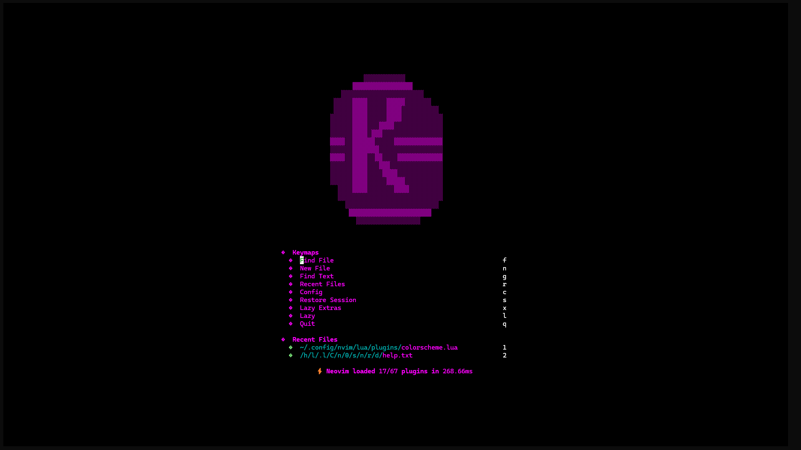
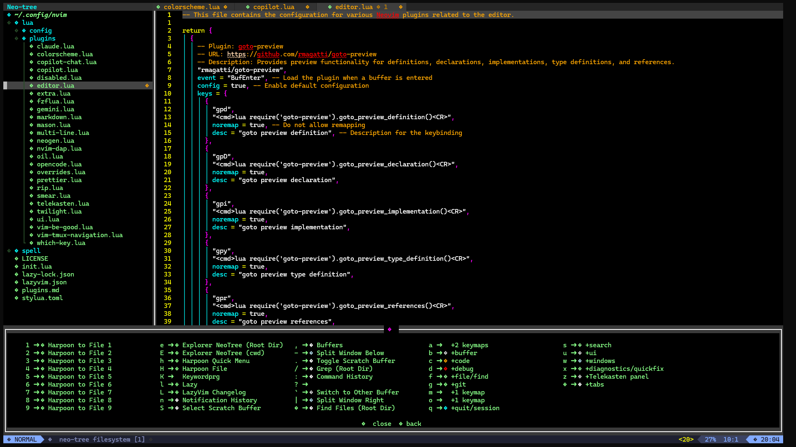

# Kinder.Vim

This is my personal Neovim configuration, designed to be a powerful and productive code editor. Originally created for my [Arch Linux setup](https://github.com/AndreaKinder/ArchKinder.Dots), it is now my primary configuration for software development.




## Features

- **Fast and Lightweight:** Optimized for performance.
- **Modern UI:** Clean and aesthetic interface with `tokyonight` theme.
- **Full LSP Support:** Autocompletion, diagnostics, and formatting.
- **AI Integration:** GitHub Copilot and Gemini support.
- **Easy Customization:** Modular structure powered by `lazy.nvim`.

## Prerequisites

- **Neovim:** Version 0.9 or higher.
- **Git:** For plugin management.
- **Nerd Font:** [Iosevka Nerd Font](https://www.nerdfonts.com/font-downloads) is recommended for proper icon display.
- **Plugin Dependencies:** Ensure you have the necessary requirements for the `mason.nvim` plugins installed.

## Installation

1.  **Clone the repository:**
    ```bash
    git clone https://github.com/AndreaKinder/Kinder.Vim.git ~/.config/nvim
    ```

2.  **Start Neovim:**
    ```bash
    nvim
    ```
    `lazy.nvim` will be installed automatically and will manage the plugins on the first startup.

## Documentation

For more detailed documentation on the project structure, plugins, and configurations, please see the [full documentation here](./docs/en/index.md).

## Contributions

Contributions are welcome. If you have any suggestions or improvements, feel free to open a *Pull Request*.
